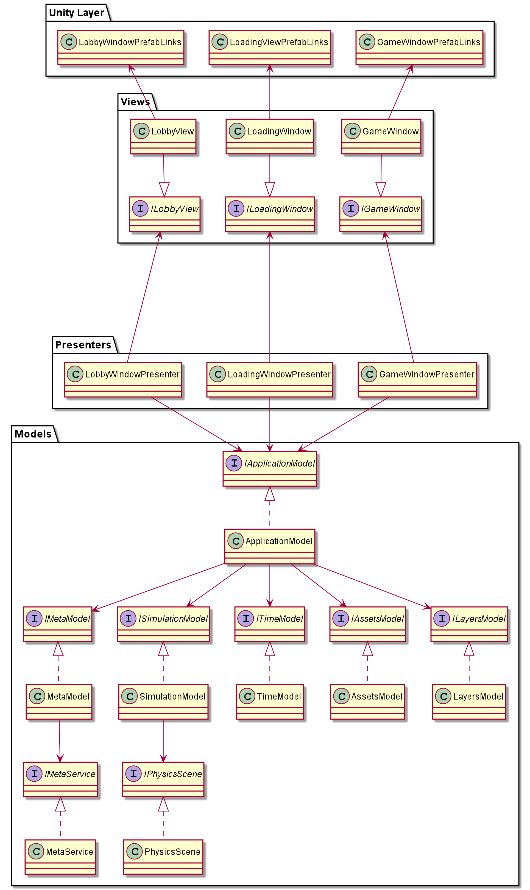

<h2> Sample Project </h2>

In this variant, all presenters work independently, same as views do.
Models have a dependency tree and execute with a strong order.

<h2> How to look the code </h2>
Open a scene Sample.scene with Unity 2019.4.15f. 
There will be only one MonoBehaviour component CompositionRoot.cs needed for initialization in Unity Runtime.

<h2> Notes </h2>

- I implemented a simple alternative to events: <b>IFlag</b> to control the execution flow when it is needed for a subscriber instead of observable object. It also gives consistency of data. I don't need to check consistency of data manually in escape all bugs related to it.
- In CompositionRoot additional noise creates UpdateWatcher.cs, I add it to every model constructor just to check that every model received one and only one update every frame. 
- I moved PhysicsScene to another entity because it needs different implementations to work with all cases:
    - Runtime
    - Editor tests
    - Play Tests.

<h2> Graph or relations between modules </h2>

